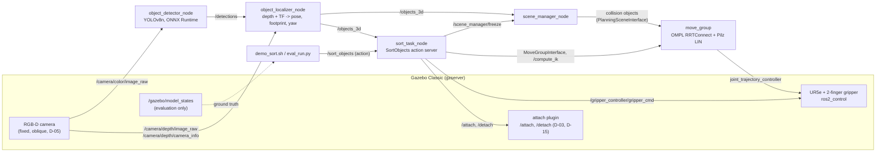

# GraspSort

Vision-guided pick-and-place sorting with YOLO, RGB-D, MoveIt 2 and ROS 2.

A simulated UR5e looks at a table with a fixed RGB-D camera, detects objects with YOLOv8n,
estimates each object's 3D pose and footprint from depth, and sorts every object into the bin for
its class, using collision-aware motion planning in MoveIt 2. The planning scene is built from
perception only. Table and bins are the only fixed collision objects.

Simulation only: ROS 2 Humble, Gazebo Classic 11, MoveIt 2, ros2_control, C++17.

## Architecture



| Package | Contents |
|---|---|
| `graspsort_msgs` | `ObjectPose`, `ObjectPoseArray`, `SortObjects.action`, `AttachLink.srv` |
| `graspsort_gazebo` | world, robot xacro (UR5e + custom gripper + camera), attach plugin, `world_layout.yaml` |
| `graspsort_bringup` | `sim.launch.py` (Gazebo, controllers, MoveIt, optional RViz), MoveIt config |
| `graspsort_perception` | `object_detector_node` (from SemNav), `object_localizer_node`, `projection.hpp`, `localizer.hpp` |
| `graspsort_scene` | `scene_manager_node`: perceived objects into the MoveIt planning scene, freeze service |
| `graspsort_manipulation` | ROS-free `grasp_planner.hpp`, `bin_assignment.hpp`, `sort_logic.hpp`; `PickPlaceExecutor`; `sort_task_node` |

The pure logic (projection, grasp candidates, bin assignment, sort ordering) is header-only and
ROS-free, with GoogleTests.

## Quick start

Tested on Ubuntu 22.04 with ROS 2 Humble and Gazebo Classic 11.

### 1. System packages (needs sudo)

```bash
sudo apt install ros-humble-desktop ros-humble-gazebo-ros-pkgs ros-humble-gazebo-ros2-control \
  ros-humble-ros2-control ros-humble-ros2-controllers ros-humble-moveit \
  ros-humble-pilz-industrial-motion-planner ros-humble-ur-description \
  ros-humble-rmw-cyclonedds-cpp ros-humble-vision-msgs ros-humble-xacro \
  python3-colcon-common-extensions python3-rosdep python3-venv curl unzip
# or, from the repo root after `sudo rosdep init && rosdep update`:
rosdep install --from-paths src --ignore-src -y
```

### 2. Pinned external assets (no sudo, need network)

```bash
scripts/fetch_models.sh     # object models -> src/graspsort_gazebo/models_external/ (SHA-256 pinned)
scripts/setup_ort.sh        # ONNX Runtime 1.20.1 C++ -> third_party/onnxruntime/ (SHA-256 pinned)
```

The detector needs `models/yolov8n.onnx`, exported from the Ultralytics YOLOv8n weights in a
separate Python venv (never in a ROS-sourced shell):

```bash
python3 -m venv .venv
.venv/bin/pip install ultralytics onnx onnxslim   # used here: ultralytics 8.4.171, onnx 1.23.1
mkdir -p models && (cd models && ../.venv/bin/python -c "from ultralytics import YOLO; YOLO('yolov8n.pt')")
.venv/bin/python scripts/export_yolo.py           # models/yolov8n.pt -> models/yolov8n.onnx
```

The export defaults are a static 1x3x640x640 input, opset 12 and no embedded NMS. Models,
weights, ONNX Runtime and the fetched object models are gitignored.

### 3. Build and test

```bash
source /opt/ros/humble/setup.bash
colcon build --symlink-install --cmake-args -DCMAKE_BUILD_TYPE=Release
colcon test --event-handlers console_direct+ && colcon test-result --verbose
```

### 4. Run the demo

Every launch file sets `RMW_IMPLEMENTATION=rmw_cyclonedds_cpp`. Terminal 1 starts the stack, with Gazebo
and RViz (`demo.rviz`: robot, planning scene, planned path, YOLO image):

```bash
cd ~/graspsort && source install/setup.bash
ros2 launch graspsort_bringup sim.launch.py gui:=true rviz:=true \
  rviz_config:=$(ros2 pkg prefix graspsort_bringup)/share/graspsort_bringup/rviz/demo.rviz &
ros2 launch graspsort_perception perception.launch.py &
ros2 launch graspsort_scene scene.launch.py &
ros2 launch graspsort_manipulation sort_task.launch.py
```

Terminal 2 sorts the table with one action call, once all four objects are perceived:

```bash
cd ~/graspsort && MIN_OBJECTS=4 scripts/demo_sort.sh
```

### 5. Evaluation

```bash
scripts/run_eval.sh     # headless; D-17 scenario, 40 trials; output in data/eval/<run_id>/
```

`run_eval.sh` starts the same four launches headless. `scripts/eval_run.py` spawns randomised
layouts with fixed seeds and unique names. `scripts/eval_summary.py` writes `results.md`. Gazebo
ground truth is used only by the evaluation scripts, never by the robot.

## Results

Headless evaluation, D-17 scenario: 40 trials with randomised positions and bottle yaw, fixed seeds,
2 or 4 objects, minimum gap 8 or 3 cm (run `d20_full`).

| Metric | Result | Target (architecture 8) |
|---|---|---|
| Objects in the correct bin, overall | 75.8 % (91/120) | |
| ... sports ball / bottle | 96.7 % (58/60) / 55.0 % (33/60) | |
| Pick success, low clutter (8 cm gap) | 76.7 % (46/60) | >= 90 %: **not met** |
| 2 objects / 4 objects | 87.5 % / 70.0 % | |
| 3D position error median, ball / bottle | 5.6 mm / 2.2 mm | < 15 mm |
| Bottle yaw error median / p95 | 9.6 / 51.1 deg (n=44) | median < 10 deg |
| Planning time p95 | 0.091 s | < 2 s |
| Reference layout, `demo_sort.sh` | 4/4 sorted in 59.4 s | |

Most bottle failures (15 of 27) are bottles the COCO YOLOv8n detector never finds. They are seen end-on,
mostly close to the camera. Detection is not affected by clutter: 10/60 objects missed at a 3 cm gap,
11/60 at 8 cm.


Full tables: [docs/results.md](docs/results.md). Decisions and evidence: [docs/DECISIONS.md](docs/DECISIONS.md).
Design notes: [docs/design-notes.md](docs/design-notes.md).

## Limitations

- **Simulation only** (Gazebo Classic 11, D-01). Grasps are held by an attach plugin (a fixed joint
  created on close, D-03), not by friction.
- **Two object classes:** sports ball and bottle (D-13). The plastic cup was never detected in the
  world and was removed. COCO YOLOv8n has no "can" or "box" class (D-04). A fine-tune is an
  optional stretch goal.
- **One fixed oblique RGB-D camera** at about 50 deg pitch, no hand-eye loop (D-05). The PDF's
  overhead camera detected only balls.
- **Custom 2-finger prismatic gripper** with a 90 mm opening, not a Robotiq 2F-85 (D-02). The
  Robotiq linkage was unstable in contact on Gazebo Classic.
- **Evaluation scale:** 2 and 4 objects with 8 / 3 cm minimum gaps, 10 trials per configuration
  (D-17), instead of the PDF's 3/5/7 objects and 2 / 8 cm.
- **Bottle detection:** COCO YOLOv8n misses about a quarter of the bottles (16/60), mostly bottles seen
  end-on close to the camera. A fine-tuned detector (D-04 stretch goal) is the fix.
- **Bottle yaw:** the camera sees only the near half of a bottle with a rounded cross-section, so yaw comes
  from minAreaRect with a long tail (p95 51 deg). The known bottle size fixes the width, centre and long
  axis (D-20), but not the tail (D-19).

## Licenses

- **GraspSort code:** Apache-2.0 (as declared in every `package.xml`).
- **ONNX Runtime 1.20.1** (fetched by `setup_ort.sh`): MIT License, Microsoft Corporation
  (`third_party/onnxruntime/LICENSE`).
- **YOLOv8n weights** (Ultralytics): AGPL-3.0 (https://ultralytics.com/license). The weights and
  the exported ONNX are not distributed in this repo.
- **Object models** (fetched and patched by `fetch_models.sh`; each model gets an `ATTRIBUTION.txt`):
  - `cricket_ball` (Nate Koenig, OSRF) and `plastic_cup` (Jackie Kay, OSRF): osrf/gazebo_models @8163eb4,
    CC BY 3.0 Unported.
  - `mustard_bottle`: Gazebo Fuel model by Adwait Naik (Gambit), mesh and texture from the YCB Object
    and Model Set (object 006; Calli et al., 2015), CC BY 4.0.
- **UR5e description** (`ur_description`, apt): BSD-3-Clause. The UR20 meshes carry Universal Robots'
  terms for graphical documentation; the UR5e is used here.
- **`sim.launch.py`** is adapted from Universal_Robots_ROS2_Gazebo_Simulation (humble, SHA 34a0417),
  BSD-3-Clause. The SRDF is based on `ur_moveit_config` 2.14 (Apache-2.0).
- **`object_detector_node`** and its tests, `setup_ort.sh` and `export_yolo.py` are copied from the
  author's SemNav project.
